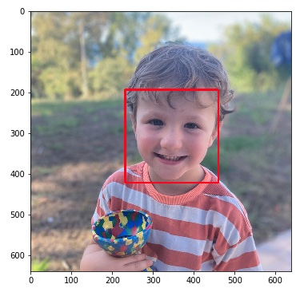
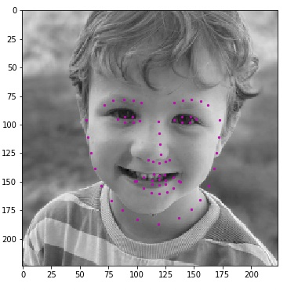
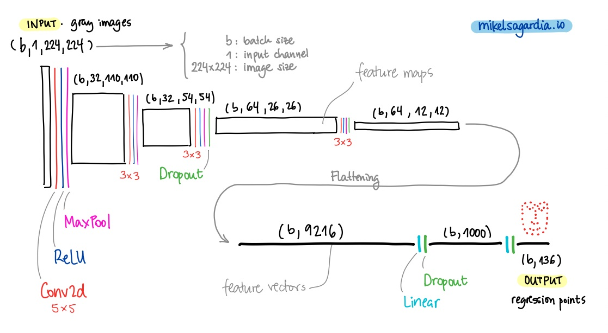

# Facial Keypoint Detection with CNNs

This repository contains a facial keypoint detection project. Deep Convolutional Neural Networks (CNNs) are used to perform a regression which maps grayscale images to 68 facial landmarks with floating point `(x,y)` coordinates each. The original starter code comes from a project/challenge presented in the [Udacity Computer Vision Nanodegree](https://www.udacity.com/course/computer-vision-nanodegree--nd891), which can be found here: [P1_Facial_Keypoints](https://github.com/udacity/P1_Facial_Keypoints). [Pytorch](https://pytorch.org/) is used as the deep learning framework.

The final result is far from production deployment quality; among others, the architecture, the model hyperparameters and the training have a large margin of improvement, as one can deduce from the evaluation metrics -- the [Improvements](#improvements-and-possible-extensions) section provides some hints about what I'd try to change if I had time. However, I am impressed by how easy it is with the modern tools we have for free to address problems that not long ago were considered *difficult*. The fact that less than 30 minutes of GPU training are enough to achieve a plausible prediction is also astonishing. My son below finds it cool, too :smile:

<table cellspacing="0" cellpadding="0" style="border-collapse: collapse; border: none;">
<tr >
<td style="border: none;">

<p align="center">
  
</p>

</td>
<td style="border: none;">

<p align="center">
  
</p>

</td>
</tr>
</table>


Images from the [Youtube Faces Dataset](https://www.cs.tau.ac.il/~wolf/ytfaces/) are used used to train the network; the preprocessed pictures as well as their ground-truth facial keypoints can be downloaded from the Udacity repository [P1_Facial_Keypoints](https://github.com/udacity/P1_Facial_Keypoints), and they consist of 5770 face instances altogether.

In short, the following is implemented:

- Custom data loader class which yields images and facial keypoints.
- Custom transform classes.
- The definition of a CNN from scratch, as well as its training and evaluation.
- The implementation of face detection using the [Haar cascades](https://en.wikipedia.org/wiki/Haar-like_feature) classifier from [OpenCV](https://docs.opencv.org/3.4/db/d28/tutorial_cascade_classifier.html).
- Image in-painting of funny objects (e.g., glasses, etc.) by using the predicted facial landmarks.

In summary, I think the project is a nice example of a computer vision application which leverages artifical neural networks; 

*For the original project implementation instructions and evaluation overview, see the file [Instructions.md](Instructions.md); instead, this text focuses on more general explanations related to the methods used in the project.*

Table of contents:

- [Facial Keypoint Detection with CNNs](#facial-keypoint-detection-with-cnns)
  - [Overview and File Structure](#overview-and-file-structure)
    - [How to Use This](#how-to-use-this)
    - [Dependencies](#dependencies)
  - [Face Detection and Facial Keypoint Regression Model](#face-detection-and-facial-keypoint-regression-model)
  - [Dog Breed Classification with CNNs](#dog-breed-classification-with-cnns)
  - [Putting Everything together: The Application](#putting-everything-together-the-application)
  - [Improvements and Possible Extensions](#improvements-and-possible-extensions)
  - [Authorship](#authorship)

## Overview and File Structure

The project is mainly implemented in four notebooks that guide the project end-to-end and two python scripts; the latter consist of the data loader and model definition. Altogether, the folder contains the following files:

```
1. Load and Visualize Data.ipynb                        # Dataset preprocessing an loader
2. Define the Network Architecture.ipynb                # Network training
3. Facial Keypoint Detection, Complete Pipeline.ipynb   # Face detection and keypoint inference
4. Fun with Keypoints.ipynb                             # Image in-painting of objects
Instructions.md                                         # Original instructions
LICENSE                                                 # MIT license by Udacity
README.md                                               # Current file
data/                                                   # Dataset images and facial keypoints
data_load.py                                            # Data loader definition
detector_architectures/                                 # Haar cascades classifiers
images/                                                 # Auxiliary images
models.py                                               # Model definiton
requirements.txt                                        # Dependencies to be installed
```

### How to Use This

The implementation has a research side-project character, thus most of the code is contained in enumerated Jupyter notebooks which should be executed in order and from start to end; note that the data loader and the model definition are in separate scripts imported in the notebooks.

I you want to train the model, you should consider doing it on a machine with powerful GPUs, although that is not a necessary condition.

### Dependencies

Please, have a look at the dependencies description in the repository [P1_Facial_Keypoints](https://github.com/udacity/P1_Facial_Keypoints).

A short summary of commands required to have all in place:

```bash
conda create -n faces python=3.6
conda activate faces
conda install pytorch torchvision -c pytorch 
conda install pip
pip install -r requirements.txt
```

## Face Detection and Facial Keypoint Regression Model

The first step consists in the implementation of two functions using off-the-shelf libraries: 

1. `face_detector()`: given an image, it returns whether there is a human face in it or not.
2. `dog_detector()`: given an image, it returns whether there is a dog in it or not.

In order to implement the `face_detector()`, the [Haar cascades](https://en.wikipedia.org/wiki/Haar-like_feature) classifier from [OpenCV](https://docs.opencv.org/3.4/db/d28/tutorial_cascade_classifier.html) is employed. This classifier applies several pre-determined filters in sequence on the target image to determine whether it contains a face. In addition to that, bounding boxes with the likeliest face regions are returned. Thus, `face_detector()` basically counts the number of face bounding boxes returned by the OpenCV API -- if there is at least one bounding box, the image contains a human face.

The function `dog_detector()`, on the other hand, leverages the pre-trained [VGG16](https://pytorch.org/vision/main/models/generated/torchvision.models.vgg16.html) network. Since most of the available pre-trained networks (as this one) have been fit on the [ImageNet](https://www.image-net.org/) dataset, they map any image to the 1000 possible object classes from ImageNet; in particular, the range of class ids 151-268 are related to different dog breeds. Hence, the function `dog_detector()` basically infers the class of an image with VGG16 and checks that it is in the aforementioned range -- if so, we have the image of a dog.

## Dog Breed Classification with CNNs

Apart from detecting a dog/human image, we want to classify the dog breed. Unfortunately, the class ids 151-268 from ImageNet are not enough for our purpose. Therefore, we create a new model using the [dog dataset](https://s3-us-west-1.amazonaws.com/udacity-aind/dog-project/dogImages.zip), which contains 133 dog breeds. Two approaches are implemented:

1. Custom CNN built from scratch.
2. Transfer learning with a ResNet50.

The first approach consists in a custom-defined CNN that follows the guidelines in the literature; it consists of 5 convolutional layers that repeat the basic formula `Convolution + BatchNorm + ReLU + MaxPool`, and a final sequence of three fully connected layers that map the feature maps of the fifth convolutional layer to the 133 class probabilities. The model has around 17 million parameters.



The second approach uses the pre-trained [ResNet50](https://pytorch.org/vision/main/models/generated/torchvision.models.resnet50.html?highlight=resnet50#torchvision.models.resnet50) network as backbone; two fully connected layers are appended to the model to map its feature vectors to the 133 dog breed classes. ResNets are nice performing CNNs, since they can handle large amounts of layers (necessary to detect complex and relevant features), while still avoiding the vanishing gradient problem, which with other architectures worsens with the network depth. Only the weights of the fully connected layers are trained, which amount to 0.4M parameters.

Given the smaller number of the trained parameters, the second model can be trained in a considerably shorter time; additionally, since the ResNet50 backbone has correctly trained weights, it produces feature maps that lead to a better accuracy than the custom CNN.

## Putting Everything together: The Application

The final application is a simple combination of three functions:

1. `face_detector()`
2. `dog_detector()`
3. The transfer learning model with the ResNet50 as backbone

If an image contains a human face or a dog, it is passed to the transfer learning model to predict the dog breed that is most likely associated with the image; if we pass a human image, the model detects the dog breed that resembles to the face on the picture :smile:

## Improvements and Possible Extensions

- [ ] Use data augmentation more extensively to improve generalization.
- [ ] Experiment with other methods for face detection and keypoint prediction. Another option could be [MTCNN](https://github.com/ipazc/mtcnn).
- [ ] Use [Pytorch profiling](https://pytorch.org/tutorials/recipes/recipes/profiler_recipe.html).
- [ ] Use `nn.Sequential` in order to be cleaner in the network definition.
- [ ] Try the [learning rate scheduler](https://pytorch.org/docs/stable/optim.html) for the from-scratch model training, since it seems to have a sub-optimal learning rate.
- [ ] Try different (more complex) architectures as well as transfer learning; an example of transfer learning using [ResNet50](https://pytorch.org/vision/main/models/generated/torchvision.models.resnet50.html?highlight=resnet50#torchvision.models.resnet50) as backbone can be found in my side project []().
- [ ] Use randomness seeds and controlled weight initialization to allow reproducibility.
- [ ] Create a web app with Flask. To that end, the code needs to be transformed for production (i.e., use OOP, logging, etc.)

## Authorship

Mikel Sagardia, 2022.  
No guarantees.

You are free to use this project, but please link it back to the original source.